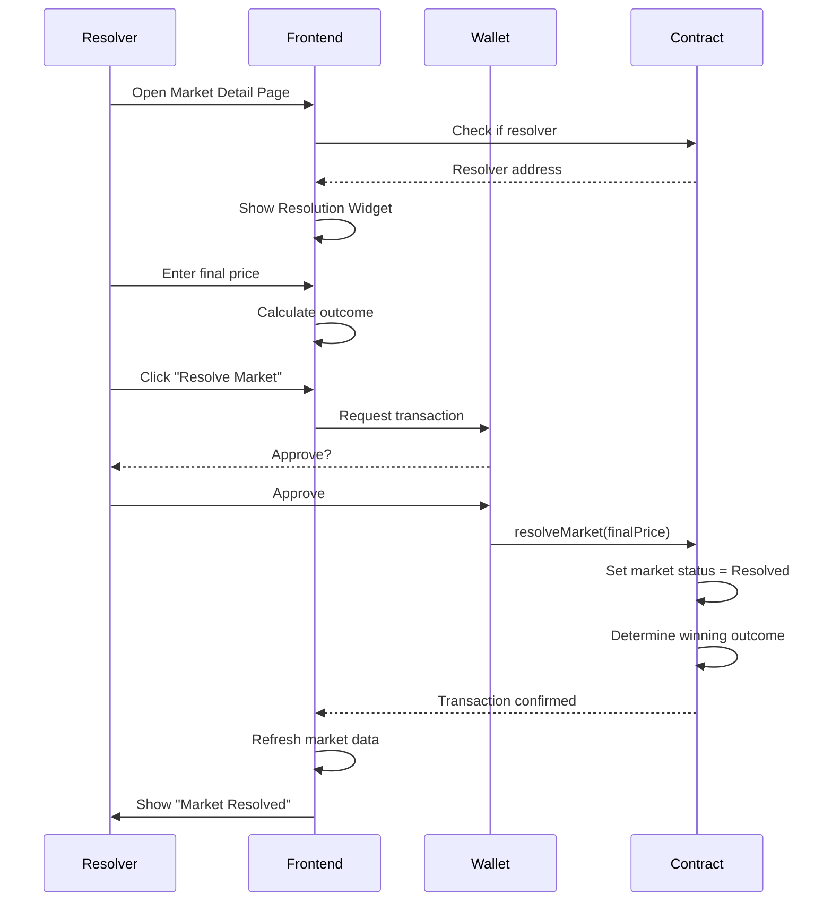

# 📋 Market Resolution Guide

## Overview

This guide explains how to resolve markets from the frontend of the MCG.fun prediction market platform.

---

## 🎯 What is Market Resolution?

Market resolution is the process of **finalizing a prediction market** by:
1. Recording the actual NFT floor price at the resolution time
2. Determining which outcome won (YES if floor > target, NO otherwise)
3. Enabling users to redeem their winning shares

---

## 👤 Who Can Resolve a Market?

**Only the designated `resolver` address** can resolve a market.

- The resolver is set when the market is created
- Typically, this is a trusted party or automated oracle
- The resolver address is stored on-chain and cannot be changed

---

## 🕐 When Can a Market Be Resolved?

A market can be resolved when:
- ✅ The **resolution date** has passed
- ✅ The market is **not already resolved**
- ✅ You are the **designated resolver**

---

## 🖥️ How to Resolve from Frontend

### Step 1: Navigate to Market Detail Page

Go to any market at: `/market/{marketAddress}`

### Step 2: Check if Resolution Widget Appears

**The resolution widget will automatically appear if:**
- Current date ≥ Resolution date
- Market is not yet resolved
- Your connected wallet is the resolver

**What you'll see:**

```
┌─────────────────────────────────────────────┐
│ 🔨 Resolve Market                           │
│                                             │
│ You are the designated resolver            │
│                                             │
│ Target Price: 0.500 ETH                    │
│ Current Floor: 0.650 ETH                   │
│                                             │
│ Final Floor Price (ETH)                    │
│ [0.650          ]                          │
│                                             │
│ Predicted Outcome: YES ✓                   │
│ 0.650 ETH > 0.500 ETH                     │
│                                             │
│ [ Resolve Market ]                         │
│                                             │
│ ⚠️ This action is irreversible           │
└─────────────────────────────────────────────┘
```

### Step 3: Enter Final Floor Price

1. **Get the accurate floor price** from OpenSea (pre-filled if available)
2. **Enter the value** in ETH (e.g., `0.650`)
3. **Verify the predicted outcome** displays correctly

### Step 4: Submit Resolution

1. Click **"Resolve Market"** button
2. **Approve the transaction** in your wallet
3. Wait for **confirmation** (transaction will appear on-chain)
4. Market status updates to **"Resolved"**

---

## 🔧 Technical Details

### Smart Contract Function

```solidity
function resolveMarket(uint256 _finalPrice) external onlyResolver
```

**Parameters:**
- `_finalPrice`: Final NFT floor price in wei (e.g., `0.5 ETH = 500000000000000000 wei`)

**Access Control:**
- Only callable by the `resolver` address
- Can only be called once per market

### Frontend Components

#### `MarketResolutionWidget.tsx`
- Located: `/components/market/MarketResolutionWidget.tsx`
- Shows resolution UI to designated resolver
- Validates input and prevents accidental resolutions

#### Hook: `useResolveMarket`
- Located: `/hooks/useMarket.ts`
- Handles transaction submission
- Manages loading/error states

**Usage:**
```typescript
const { resolveMarket, isPending, isConfirming, isConfirmed } = 
  useResolveMarket(marketAddress);

await resolveMarket(finalPrice); // finalPrice as string in ETH
```

---

## 📊 Resolution Flow



---

## 🎨 UI States

### 1. **Not Resolver** (Information Banner)
```
⚠️ Resolution Pending
This market can only be resolved by the designated resolver.
Resolver: 0x1234...5678
```

### 2. **Resolver - Active** (Resolution Form)
```
🔨 Resolve Market
[Input form with final price entry]
[Predicted outcome display]
[Resolve button]
```

### 3. **Resolving** (Loading State)
```
🔨 Resolve Market
[⏳ Resolving...]
```

### 4. **Resolved** (Success State)
```
✅ Market Resolved
The market has been successfully resolved at 0.650 ETH.
Winning Outcome: YES
```

---

## 🚨 Important Warnings

### ⚠️ Resolution is Irreversible
- Once resolved, **cannot be changed**
- Ensure final price is **accurate**
- Double-check before confirming

### ⚠️ Only Resolver Can Act
- If you're not the resolver, you'll see an info banner
- Contact the designated resolver if needed

### ⚠️ Wait for Resolution Date
- Resolution widget only appears **after** resolution date
- Trading continues until resolution

---

## 📝 Example Scenarios

### Scenario 1: YES Outcome
```
Target Price: 0.500 ETH
Final Floor:  0.650 ETH
Outcome:      YES (0.650 > 0.500)
Winners:      YES share holders
```

### Scenario 2: NO Outcome
```
Target Price: 0.500 ETH
Final Floor:  0.350 ETH
Outcome:      NO (0.350 ≤ 0.500)
Winners:      NO share holders
```

### Scenario 3: Exact Target
```
Target Price: 0.500 ETH
Final Floor:  0.500 ETH
Outcome:      NO (0.500 ≤ 0.500)
Winners:      NO share holders
```

---

## 🧪 Testing Resolution

### Local Testing
1. **Create a test market** with your address as resolver
2. **Set resolution date** to past date
3. **Navigate to market** page
4. **Verify resolution widget** appears
5. **Enter test price** and resolve
6. **Check market status** updates correctly

### Testnet (Base Sepolia)
1. Deploy market on Base Sepolia testnet
2. Use testnet ETH for gas
3. Test full resolution flow
4. Verify events on Etherscan

---

## 🔍 Debugging

### Widget Doesn't Appear?

**Check:**
- ✅ Are you connected to the correct wallet?
- ✅ Is your address the resolver? (Check contract)
- ✅ Has the resolution date passed?
- ✅ Is the market already resolved?

### Transaction Fails?

**Common Issues:**
- ❌ Not the resolver address
- ❌ Market already resolved
- ❌ Invalid final price (negative/zero)
- ❌ Insufficient gas

### Price Not Pre-filled?

The current floor price is fetched from OpenSea API:
- May be slow or fail
- Manually enter the correct price
- Verify on OpenSea directly

---

## 📚 Related Components

- **`RedemptionWidget.tsx`** - Allows users to claim winnings after resolution
- **`TradeWidget.tsx`** - Disabled after resolution
- **`MarketStats.tsx`** - Shows resolution status

---

## 🎯 Best Practices

1. **Verify Floor Price**
   - Check OpenSea directly
   - Use multiple data sources if possible
   - Screenshot proof for records

2. **Resolution Timing**
   - Resolve promptly after resolution date
   - Don't delay - users are waiting to redeem
   - Consider automation in production

3. **Communication**
   - Announce resolution on social media
   - Notify users of outcome
   - Provide proof of floor price

4. **Security**
   - Keep resolver private key secure
   - Use hardware wallet for high-value markets
   - Consider multi-sig for large resolutions

---

## 📞 Support

If you encounter issues:
1. Check browser console for errors
2. Verify wallet connection
3. Check transaction on Etherscan
4. Review smart contract events

---

## ✅ Summary

**To resolve a market:**
1. ✓ Be the designated resolver
2. ✓ Wait for resolution date
3. ✓ Navigate to market detail page
4. ✓ Enter accurate final floor price
5. ✓ Confirm transaction
6. ✓ Market becomes resolved
7. ✓ Users can redeem winnings

**Market resolution is now fully integrated into the frontend!** 🎉

